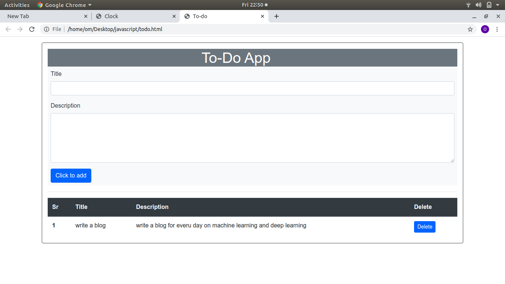

# Digital-Clock-and-To-Do-app-using-html-css-and-js

### The repo contains two files:-
  **1.clock.html** -->*It written using html css boostrap4 and using a js.*
  *It will give a real time date and time in html page*\
**OUTPUT**

#    
**2.todo.html**-->*This file written using a boostrap4 and js ,css.In this project file , user can add title and description of routine and the data is stored in local
storage and retrived to show all the details in page.and also can delete a data on click delete.

**OUTPUT**

#

#

